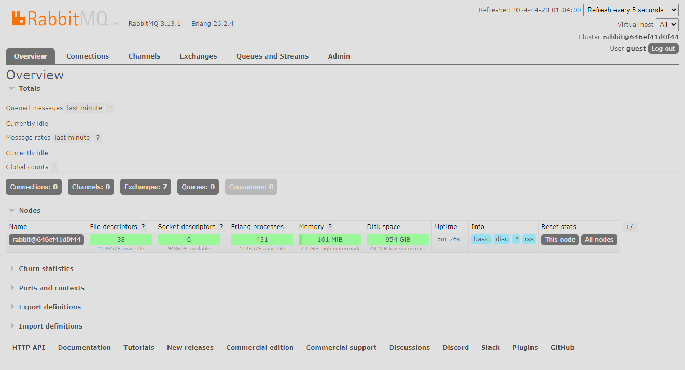
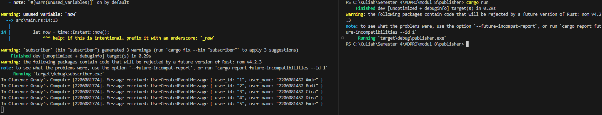
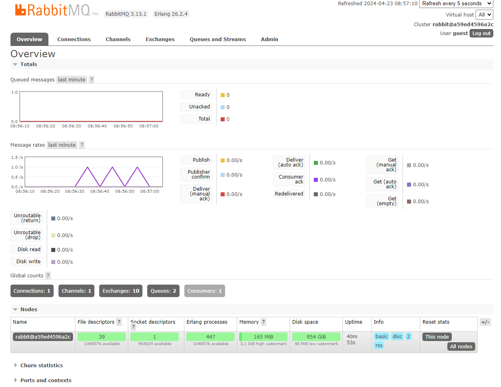

a. it will send 5 data to the message broker in one run because there are 5 publish_event methods.
 
 
b. Both url are the same because both send request to the same rabbitMQ server. The only difference is publisher will send message to the queue and subscriber will receive data from the queue.

this screenshot shows that the publisher send 5 data to the queue.

this screenshot shows that the chart has some spikes because the publisher has run multiple times.